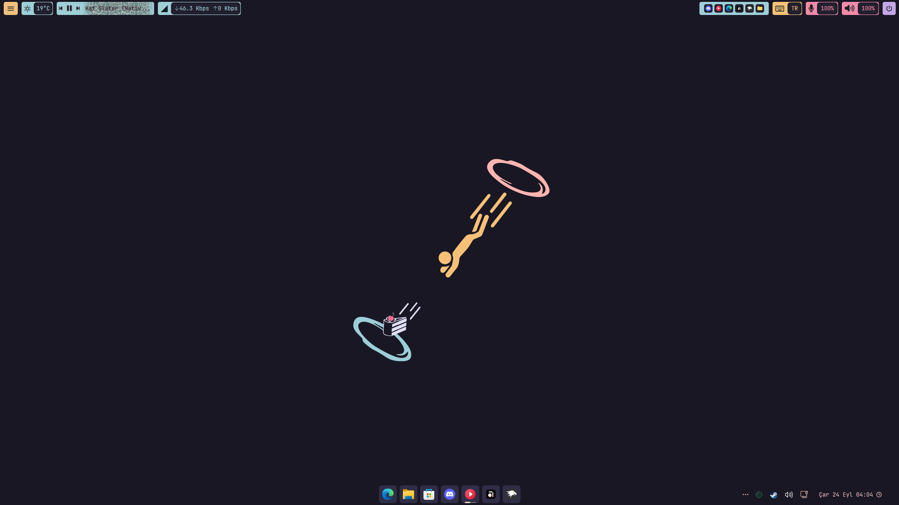
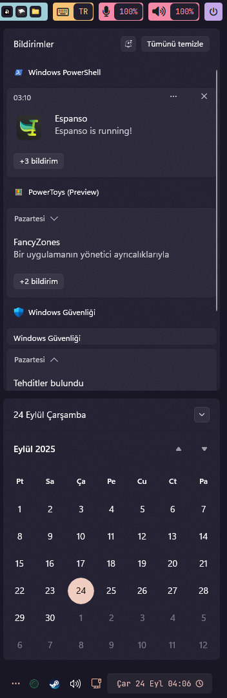
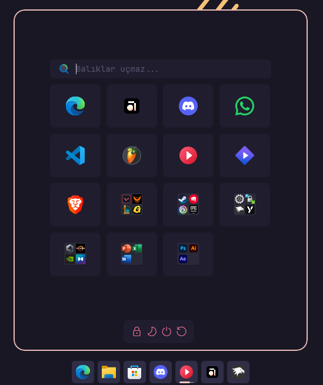
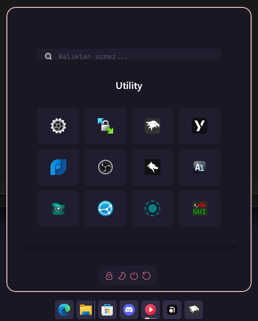
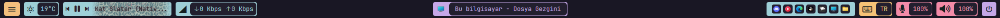

# Windows 11 Customization Setup

This repository contains my personal configuration files and instructions for customizing Windows 11 using **Windhawk** and **YASB Reborn**.

---

## 🚀 Windhawk

### Mods that I use:
1. Windows 11 Start Menu Styler  
2. Windows 11 Taskbar Styler  
3. Windows 11 Notification Center Styler  
4. Windows 11 File Explorer Styler  
5. Taskbar Clock Customization  
6. Taskbar Tray System Icon Tweaks  
7. Taskbar Volume Control (No edits required)  

### Usage:
- Replace the code in the **Advanced** tab of the installed mods with the content of the files named `paste_in_advanced_tab.json`, which can be found inside the corresponding folders above.

---

## 🎨 YASB Reborn

### Usage:
- Right-click the **YASB tray icon**, select **Open Config**, and replace the files with mine.

---

## 📸 Screenshots / Ekran Görüntüleri

### 🖥️ Desktop

### 🔔 Notification Center + Clock

### 📂 Start Menu
  

### 📌 Taskbar
  
  

### 🎛️ YASB
  

---

## 🇹🇷 Türkçe Açıklama

### Windhawk

#### Kullandığım modlar:
1. Windows 11 Start Menu Styler  
2. Windows 11 Taskbar Styler  
3. Windows 11 Notification Center Styler  
4. Windows 11 File Explorer Styler  
5. Taskbar Clock Customization  
6. Taskbar Tray System Icon Tweaks  
7. Taskbar Volume Control (Düzenleme gerektirmez)  

#### Kullanım:
- Yüklü modların **Advanced** sekmesindeki kodları, ilgili klasörlerde bulunan `paste_in_advanced_tab.json` dosyalarının içeriğiyle değiştirin.  

---

### YASB Reborn

#### Kullanım:
- YASB tepsi simgesine sağ tıklayın, **Open Config** seçeneğini seçin ve dosyaları benimkilerle değiştirin.  
